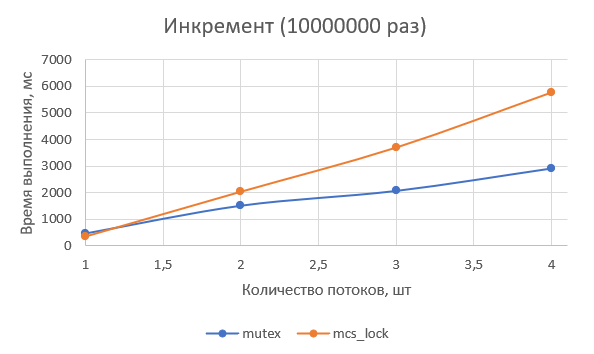
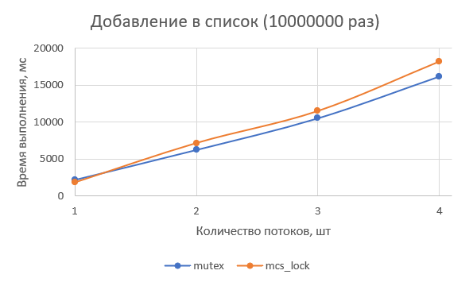
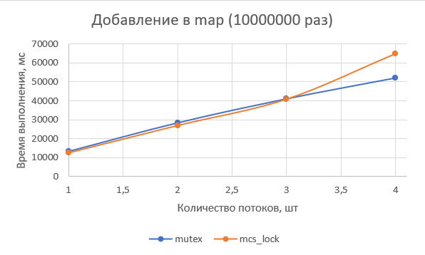

## Laboratory work 1. Atomic snapshots, locks

---

### Locks
1. Design algorithm of spinlock (C++/C is preferred, Java is ok)
2. Design simple benchmark
3. Evaluate the efficiency, build plots, analyze, make conclusion

---

Алгоритм - MCS-lock.

Пример работы:

```
C:\Lab1> MCS_Lock.exe
Number of hardware thread contexts on machine 4
Operations count 10000000
*** std::mutex lock_test ***
thread, exec time
1, 2230 ms
2, 6282 ms
3, 10559 ms
4, 16215 ms
***  mcs_lock lock_test ***
thread, exec time
1, 1824 ms
2, 7160 ms
3, 11502 ms
4, 18210 ms

Process finished with exit code 0
```

#### Бенчмарк

Провел тесты с MCS-lock и std::mutex. В критической секции производился инкремент, добавление элемента в list, добавление элемента в set, 10000000 раз в каждом случае.

Тестовая машина: Intel Core i5-7200U, 2 ядра, 4 потока, RAM 8 GB. 

Результаты:







#### Выводы

Алгоритм MCS формирует общую очередь ожидающих потоков и ожидающий поток "опрашивает" только предшественника. Ожидание потока сводится к проверке значения своей (локальной) переменной. За счет этого поддержка когерентности кэша должна быть "проще" в сравнении с блокировками, которые основаны на проверке значения одной, общей для всех потоков, переменной. Также, за счет "локальности", возможно сокращение потока данных, передаваемого между ядрами процессора.

По результатам бенчмарка MCS показал себя хуже std::mutex в большей части тестов. Только в тесте со структурой map для 1, 2 и 3 потоков MCS оказался лучше. В тесте с list время выполнения алгоритма MCS возрастает сходным с std::mutex образом.

Такой результат мог получиться за счет реализации std::mutex, которая в зависимости от ОС и компилятора может отдавать потоку квант времени через определенное число циклов. Кроме того, бенчмарк проводился на процессоре с 2 ядра и 4 потоками; малое число потоков могло помешать MCS показать лучший результат. 
